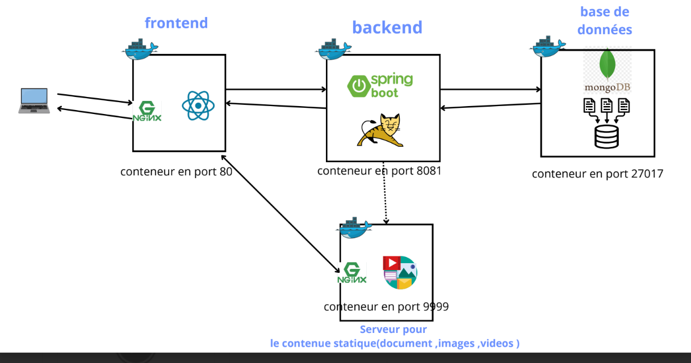

# Document Sharing Application

A secure document management system built with Spring Boot, enabling users to store, organize, and share files.

**Author:** Mahdi Chaaben  
**Institution:** Higher Institute of Computer Science and Multimedia of Sfax  
**Demo Video:** [View Demo](https://drive.google.com/file/d/16OiFlDSA8u720J9qNbtof7uf2mjsMqdO/view?usp=sharing)

## 🚀 Features
- JWT-based authentication
- File upload/download (images, videos, PDFs)
- Folder organization and sharing
- Secure file storage

## 🏗️ Architecture
| Component | Port | Technology |
|-----------|------|------------|
| Frontend | 80 | React + Vite |
| Backend | 8081 | Spring Boot + JWT |
| Database | 27017 | MongoDB |
| Static Server | 9999 | Nginx |



*Containerized microservices architecture with Docker deployment*

## 🛠️ Tech Stack
- **Backend**: Spring Boot 3.4.0, Java 17, MongoDB, JWT
- **Frontend**: React 18, Vite, Tailwind CSS
- **Database**: MongoDB with Mongo Express UI

## 📋 Prerequisites
- Docker, Java 17, Node.js

## 🚀 Quick Start

1. **Start MongoDB & Mongo Express**
   ```bash
   cd mongodb_dockerimage
   docker-compose up -d
   ```

2. **Start Static File Server**
   ```bash
   cd NginxServer_dockerimage
   docker-compose up -d
   ```

3. **Run Backend**
   ```bash
   cd backend
   ./mvnw spring-boot:run
   ```

4. **Run Frontend**
   ```bash
   cd frontend
   npm install && npm run dev
   ```

## 🌐 Access URLs
- **Frontend**: http://localhost:80
- **Backend API**: http://localhost:8081
- **Swagger UI**: http://localhost:8081/swagger-ui.html
- **MongoDB**: mongodb://localhost:27017 (admin/pass)
- **Mongo Express**: http://localhost:8083 (mahdi/mahdi)
- **File Server**: http://localhost:9999


**Made by Mahdi Chaaben**  
**Demo:** [View Application](https://drive.google.com/file/d/16OiFlDSA8u720J9qNbtof7uf2mjsMqdO/view?usp=sharing)
